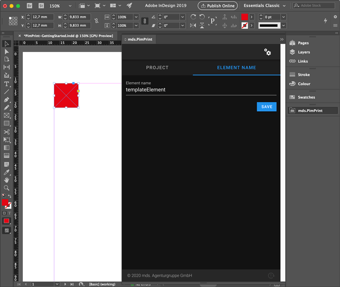
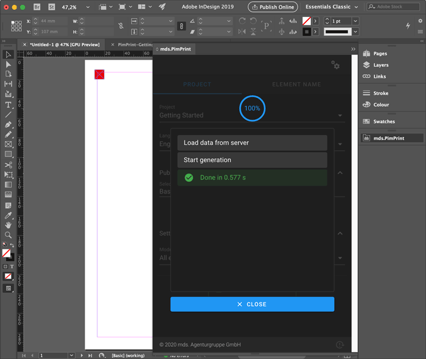

# Basic Concept

With PimPrint you create elements in an InDesign file, acting as the template for document generation defining fonts and formats. When rendering a document, elements from the
template file are copied into the generated InDesign document. While coping elements they can be freely positioned, resized and filled with content. This is done by
using [Commands](../15_Rendering_Commands.md) to send rendering instructions to the Plugin which creates the InDesign print product.

## Defining template elements

Elements used in document generation are defined by assigning them identifying names with the PimPrint-Plugin. This element name is used serverside to identify template elements in
the `elementName` parameter of rendering [Commands](../15_Rendering_Commands.md).

Open the _Element name_ pane, select an InDesign page element, enter a name and click the save button.



The example assigns the identifier `templateElement` to the red square in order to use it in the generation of rendering instructions for the plugin.

Every document generation process can use elements of one InDesign template file. The template file contains elements defining the format, like fonts and styles, of the final
document. All content, positioning and placement is implemented serverside.

## Using template elements

In PHP the `CopyBox` Command is the most basic Command which just copies an element from the template file into the generated document.

The following example copies the above create element `templateElement` from the template file into the generated document at the fixed position _top: 10mm / left: 10mm_.

```php
$command = new CopyBox('templateElement', 10, 10);
$this->addCommand($command);
```

## Generated InDesign document

The above example creates a document containing the red square from the template. The output in InDesign looks as followed:




