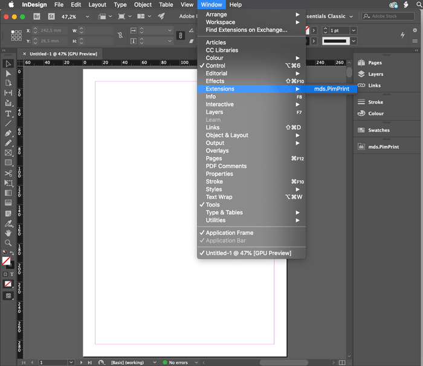
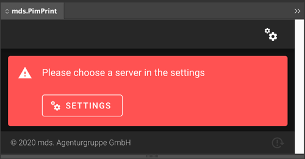

# PimPrint for Pimcore Installation

## Prerequisites

The following guide assumes you have a running [Pimcore](https://pimcore.com) 10.x installation. For installing Pimcore please visit
the [Pimcore Installation documentation](https://pimcore.com/docs/pimcore/current/Development_Documentation/Getting_Started/Installation.html).

For other Pimcore versions, please refer to the [Supported Pimcore Versions](../README.md#page_Supported_Pimcore_Versions) section.

## Installing PimPrint into Pimcore 10

Install the `MdsPimPrintCoreBundle` into your Pimcore by issuing:

```bash
composer require mds-agenturgruppe/pimprint-core-bundle:^3.0
```

Enable `MdsPimPrintCoreBundle` with:

```bash
bin/console pimcore:bundle:enable MdsPimPrintCoreBundle
```

PimPrint needs a Symfony security firewall for handling the user authentication process.
Add the firewall configuration right after `pimcore_admin` in the `firewall` section of your `security.yaml` file.

Choose the right configuration for Authenricator or Guard based security.

#### Authenticator based security

```yaml
pimprint_api:
    pattern: ^/pimprint-api
    stateless: true
    provider: pimcore_admin
    entry_point: Mds\PimPrint\CoreBundle\Security\Authenticator\AdminSessionAuthenticator
    custom_authenticators:
        - Mds\PimPrint\CoreBundle\Security\Authenticator\AdminSessionAuthenticator
        - Mds\PimPrint\CoreBundle\Security\Authenticator\InDesignAuthenticator
```

#### Guard based security

```yaml
pimprint_api:
    pattern: ^/pimprint-api
    stateless: true
    provider: pimcore_admin
    guard:
        entry_point: Mds\PimPrint\CoreBundle\Security\Guard\AdminSessionAuthenticator
        authenticators:
            - Mds\PimPrint\CoreBundle\Security\Guard\InDesignAuthenticator
            - Mds\PimPrint\CoreBundle\Security\Guard\AdminSessionAuthenticator 
```

To automatically add the matching firewall by the installer issue:

```shell
 bin/console pimcore:bundle:install MdsPimPrintCoreBundle -n
```

> <strong>Attention</strong>:<br>
> Do not be surprised that your `security.yaml` looks ugly after automatic installation!<br>
> `\Symfony\Component\Yaml\Yaml::dump()` sometimes creates really ugly files.

## Installing PimPrint InDesign-Plugin

The InDesign plugin provided by mds as an CEP-Extension ZXP-File. Please email <a href="mailto:info@mds.eu?subject=PimPrint Plugin">info@mds.eu</a> to get the plugin and further
information.

For easy installation of the ZXP-File we recommend [Anastasiy’s Extension Manager](https://install.anastasiy.com) available for Mac and Windows platforms.
Install the extension manager, launch it and choose the `mds.pimprint.indesign.plugin.v2-x.x.x.zxp` extension file to install.

## Connecting the InDesign-Plugin with Pimcore

Start InDesign and open the mds.PimPrint Plugin from the InDesign main menu.


The first time the plugin is started a server connection must be configured.


Click on the _Settings_ button to open the plugin settings pane. Please refer to the [Server connection page](../20_InDesign_Plugin/00_Server_connection.md) to learn how to
configure a server connection.


 

