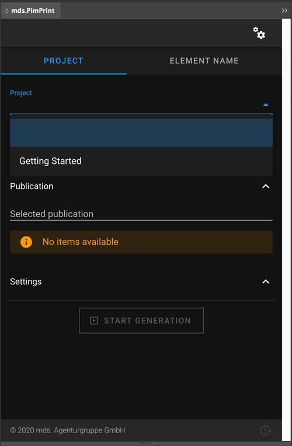
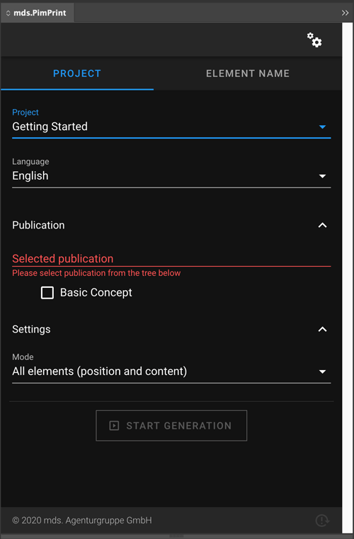
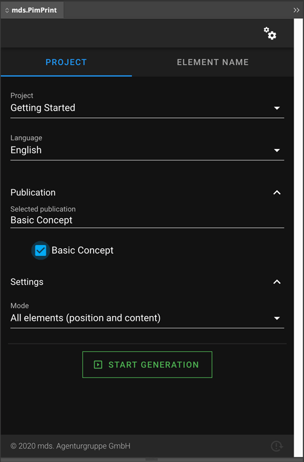

# PimPrint rendering project
PimPrint InDesign rendering is based on so-called projects, which usually is one print product in a defined content structure. One server can have multiple projects, which are displayed in the Plugin and can be selected for generating documents. The content of your Pimcore database to generate the selected project is defined by the so-called publication. This can link to Pimcore DataObjects, Documents, Assets, or any other data source handled by your Pimcore. The Plugin shows all publications of a project in a tree view, to give the option of displaying hierarchical structures to have a better overview in InDesign. 
 
The following chapters shows the basic steps to create a rendering project that shows up in the Plugin and send publications to generate: 
 - [Creating a project](#page_Creating_a_project)
 - [Defining publications to generate](#page_Defining_publications_to_generate)
 - [Generate a publication](#page_Generate_a_publication)

The `GettingStarted` example below is integrated in [PimPrint-Demo](../05_PimPrint-Demo/README.md). 

## Creating a project
Create a class which extends `\Mds\PimPrint\CoreBundle\Project\RenderingProject`.
```php
<?php
use Mds\PimPrint\CoreBundle\Project\RenderingProject;

class GettingStarted extends RenderingProject
{
    /**
     * Returns all publications in tree structure to display in InDesign-Plugin.
     *
     * @return array
     */
    public function getPublicationsTree(): array
    {
        return [];
    }

    /**
     * Generates InDesign Commands to build the selected publication in InDesign.
     *
     * @return void
     */
    public function buildPublication(): void
    {
    }
}
```
Register the class as a Symfony service.
```yaml
services:
  _defaults:
    autowire: true
    autoconfigure: true
    public: false

  AppBundle\Services\GettingStarted:
    parent: mds.pimprint.core.rendering_project
    public: true
    autowire: true
    autoconfigure: false
```  
Project services must use `mds.pimprint.core.rendering_project` as `parent` and be defined as `public` service. 

The project must be registered in `MdsPimPrintCoreBundle` by adding configuration to the `mds_pim_print_core` node:
```yaml
mds_pim_print_core:
    projects:
        gettingStarted:
            ident: 'gettingStarted'
            name: 'Getting Started'
            service: 'AppBundle\Services\GettingStarted'
            template:
                default: 'PimPrint-GettingStarted.indd'
```
The example above shows the minimum required configuration. A reference of all configuration parameters can be found on [Configuration Reference](../10_Rendering_Projects/00_Configuration_Reference.md).

After these steps the project _Getting Started_ is displayed in the plugin project field:


## Defining publications to generate
The project publications are returned by the `getPublicationsTree()` method. This method creates an array of the corresponding structure:
```php
return [
    0 => [
        'identifier' => 'Identifier',
        'label'      => 'Label shown in Plugin',
        'children'   => [
            0 => [
                'identifier' => 'child',
                'label'      => 'Child element',
                'children'   => [],
            ],   
        ],
    ],
];
```
For convenient creation if this array `MdsPimPrintCoreBundle` offers the ready to use Service `\Mds\PimPrint\CoreBundle\Service\InDesign\PublicationTreeBuilder`. Inject this service into the project service and use it to return publications displayed the plugin.

Custom domain logic can be implemented by extending the service like shown in [PimPrint-Demo](../05_PimPrint-Demo/README.md) with `\Mds\PimPrint\DemoBundle\Service\DataPrintPublicationLoader`.
```php
<?php
use Mds\PimPrint\CoreBundle\Service\InDesign\PublicationTreeBuilder;

class GettingStarted extends RenderingProject
{
    /**
     * PublicationTreeBuilder instance.
     *
     * @var PublicationTreeBuilder
     */
    private $treeBuilder;

    /**
     * GettingStarted constructor.
     *
     * @param PublicationTreeBuilder $treeBuilder
     */
    public function __construct(PublicationTreeBuilder $treeBuilder)
    {
        $this->treeBuilder = $treeBuilder;
    }

    /**
     * {@inheritDoc}
     *
     * @return array
     */
    public function getPublicationsTree(): array
    {
        return [
            $this->treeBuilder->buildTreeElement('basicConcept', 'Basic Concept')
        ];
    }
}
```
The publication _Basic Concept_ is displayed in Plugin when the _Getting Started_ is selected:


## Generate a publication
The generation process of a publication is done in `buildPublication()`, which is called when the Plugin starts the generation of a publication. The Plugin passes the `identifier` of the selected publication as a parameter. By using DataObject or Document Ids as identifiers the creation of Rendering Commands can reference to data stored in Pimcore. To generate the server response with rendering instructions for the Plugin, [Command classes](../15_Rendering_Commands.md) are used to place elements in InDesign and fill them with content. This generation process is completely customer specific and can interpret any data model integrated into Pimcore.

The following example creates the document generated describing the [Basic Concept](./00_Basic_Concept.md).

```php
/**
 * Generates InDesign Commands to build the selected publication in InDesign.
 *
 * @return void
 */
public function buildPublication(): void
{
    //Initialize the InDesign rendering
    $this->startRendering();

    //Copy the element named 'templateElement' from template document into the generated document.
    $command = new CopyBox('templateElement', 10, 10);
    $this->addCommand($command);
}
```

After implementing the rendering and Command creation the generated process in InDesign can be started by selecting the desired publication and clicking on the _Start Generation_ button.



Please refer to the [PimPrint-Demo](../05_PimPrint-Demo/README.md) for detailed examples showing many features of PimPrint. For further technical details for developers on how to implement rendering Services refer to the [Development](../25_Development/README.md) section of this documentation.


