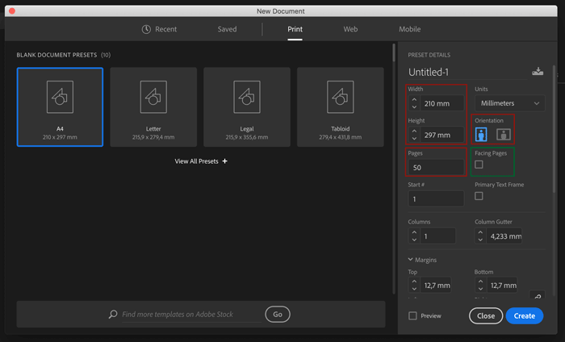
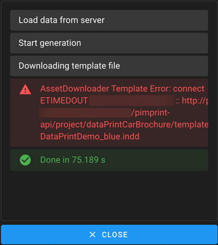
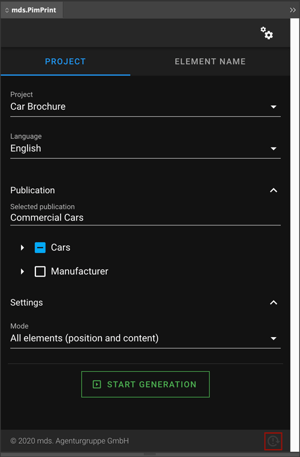

# PimPrint-Demo Overview

* [Included projects](#page_Included_projects)
* [Create a new document](#page_Create_a_new_document)
* [Generate a document](#page_Generate_a_document)
* [Asset download issues](#page_Asset_download_issues)
* [Reload Plugin](#page_Reload_Plugin)

# Included projects

PimPrint-Demo includes several demo rendering projects.

## Basic technical examples

| Project                             | Description                                                                                                                                                                                                                   |
|-------------------------------------|-------------------------------------------------------------------------------------------------------------------------------------------------------------------------------------------------------------------------------|
| Getting Started                     | Project from the [Getting Started](../01_Getting_Started/README.md) section, explaining the [basic concept](../01_Getting_Started/00_Basic_Concept.md) of PimPrint.                                                           |
| [Command Demo](./03_CommandDemo.md) | Fully source code documented demo of all PimPrint [Rendering Commands](../15_Rendering_Commands.md).                                                                                                                          |
| LocalizationDemo                    | Example of a MasterLocaleRenderingProject. Rendering allows generation of document in a master locale. When rendering additional languages positions and dimensions for elements can be used from the rendered master locale. |

## DataPrint examples

Example print products generating Pimcore Demo content showing the native integration with Pimcore.   
Layout and content structure is inspired by the Web2Print Demo-Catalog in Pimcore Demo.

| Project                                       | Description                                                                                              |
|-----------------------------------------------|----------------------------------------------------------------------------------------------------------|
| [Car Brochure](./04_DataPrint_Demos.md)       | Brochures with car variants.<br>[Example Car Brochure PDF](../examples/PimPrint-Example_CarBrochure.pdf) |
| [Car List](./04_DataPrint_Demos.md)           | Lists with car variants.<br>[Example Car List PDF](../examples/PimPrint-Example_CarList.pdf)             |
| [AccessoryPart List](./04_DataPrint_Demos.md) | AccessoryParts in the same layout as Car lists.                                                          |

# Create a new document

All demos generate A4 portrait print documents. The page dimensions, marings, amount of pages, etc. are set automatically by PimPrint. So just create an empty new document.



All demos are implemented in a way that they can create single and facing page documents. The setting _Facing Pages_ (marked green in the screenshot above) can either be
unchecked (single page document) or checken (facing page document). The setting _Start_ (merked red in the screenshot above) can be set to 1 or 2, to start on a left or right page.
The only difference in generation will be the generation of page layout elements.

# Generate a document

To generate a document with the PimPrint Demo, create a [new document](#page_Document_format) as described above.  
Open the PimPrint InDesign plugin, open the _Project_ pane, select a project, a publication and click on the green _Start Generation_ button.


This will start the rendering process of the InDesign document.


Generating InDesign documents with PimPrint is as easy. Now it is a good time to explore the [demo projects](#page_Included_projects).

## Asset download issues

Download errors are displayed in the generation overlay.



This might be because Pimcore is running in a Proxy environment. Please refer to the [Development section](../25_Development/README.md#page_PimPrint_with_HTTP_Proxy) for details.
The config file you probably will have to edit is:

```
vendor/mds-agenturgruppe/pimprint-demo-bundle/src/Resources/config/pimcore/pimprint.yml
```  

## Reload Plugin

To instantly reload the Plugin click on the small icon at the lower right corner of the window.


