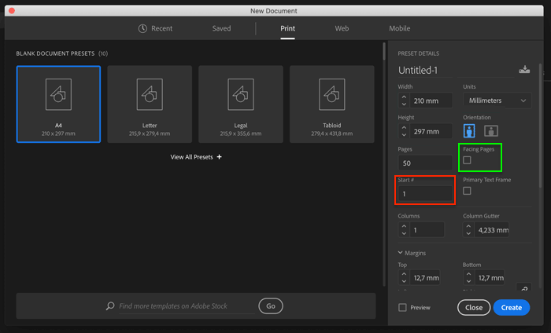
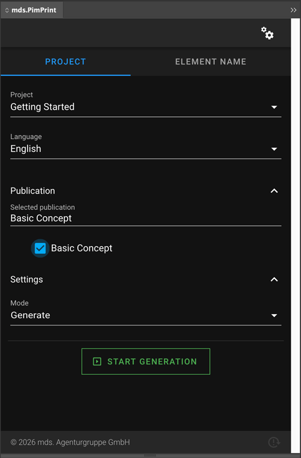
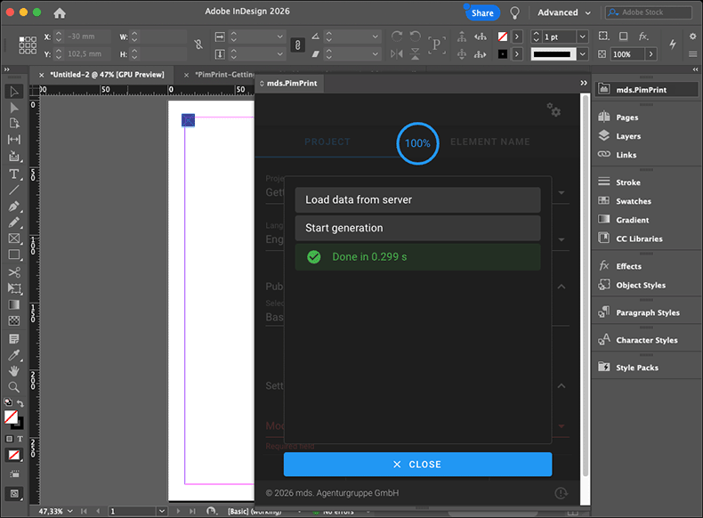
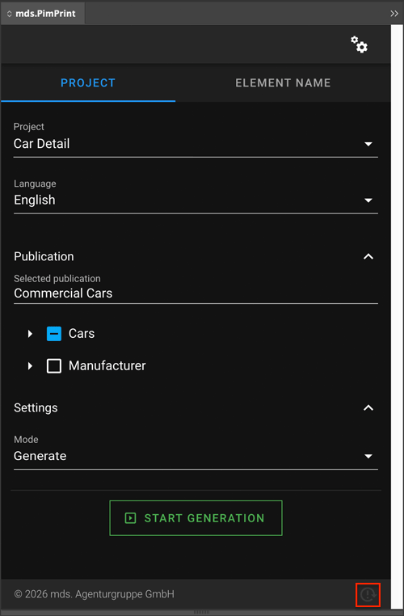
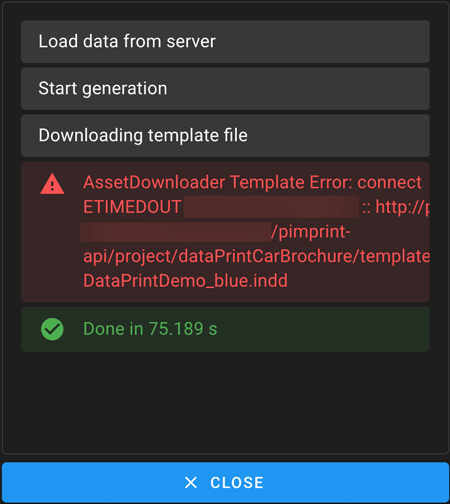

# PimPrint-Demo Overview

* [Included projects](#page_Included_projects)
* [Create a new document](#page_Create_a_new_document)
* [Generate a document](#page_Generate_a_document)
* [Asset download issues](#page_Asset_download_issues)
* [Reload Plugin](#page_Reload_Plugin)

# Included projects

PimPrint-Demo includes several demo rendering projects.

## Basic technical examples

| Project                                                | Description                                                                                                                                                                                                     |
|--------------------------------------------------------|-----------------------------------------------------------------------------------------------------------------------------------------------------------------------------------------------------------------|
| Getting Started                                        | Project from the [Getting Started](../01_Getting_Started/README.md) section, explaining the [basic concept](../01_Getting_Started/00_Basic_Concept.md) of PimPrint.                                             |
| [Command Demo](./02_CommandDemo.md)                    | Fully source code documented demo of all PimPrint [Rendering Commands](../15_Rendering_Commands.md).                                                                                                            |
| [LocalizationDemo](./03_LocalizationDemo.md)           | Example of a `MasterLocale`. Rendering allows generation of document in a master locale. When rendering additional languages positions and dimensions for elements can be used from the rendered master locale. |
| [DynamicPaginationDemo](./04_DynamicPaginationDemo.md) | Example of dynamic column break with pagination.                                                                                                                                                                |

## CarsDemo examples

Example print products that generate Pimcore Demo content showing the native integration with any Pimcore data model.

| Project                                  | Description                                                                                                                                                                                                                                                                                                                        |
|------------------------------------------|------------------------------------------------------------------------------------------------------------------------------------------------------------------------------------------------------------------------------------------------------------------------------------------------------------------------------------|
| [Car List](./05_CarsDemo.md)             | Car List is a simple list page showing the various cars. The individual cars are dynamically placed on several pages using a grid. Cars of each category or manufacturer are rendered as chapters. Each chapter starts on a new page.<br>[Example PDF Car List](../examples/PimPrint-Example_CarList.pdf)                          |
| [Car Detail](./05_CarsDemo.md)           | Car Detail creates a detailed page of a car. Each car is placed on a single page. These are always structured according to the same pattern. The individual elements like image, tables or accessories are fixed in position.<br>[Example PDF Car Detail](../examples/PimPrint-Example_CarDetail.pdf)                              |
| [Car Sales Label](./05_CarsDemo.md)      | Sales Label shows an example of a sales sign for a car. This is a layout for generating a single page. Layout elements are located on a separate layer in the template, which is copied into the generated file.<br>[Example PDF Car Sales Label](../examples/PimPrint-Example_CarSalesLabel.pdf)                                  |
| [Accessory List](./05_CarsDemo.md)       | Accessory List is a list in which each individual accessory is grouped and dynamically placed one after the other with automatic pagination. Cars of each category or manufacturer are rendered as a chapters. Each chapter starts on a new page. <br>[Example PDF Accessory List](../examples/PimPrint-Example_AccessoryList.pdf) |
| [Accessory Price List](./05_CarsDemo.md) | Accessory Price List displays a list in a table. The table splits automatically over multiple while keeping the InDesign table connected for later manual layout adaptions.<br>[Example PDF Accessory Price List](../examples/PimPrint-Example_AccessoryPriceList.pdf)                                                             |

# Create a new document

Create an empty new document in InDesign. The page dimensions, margins, number of pages, etc. are set automatically by PimPrint.



All demos are implemented in a way that they can create single and facing page documents - except the sales label. The setting _Facing Pages_ (marked green in the screenshot above)
can either be
unchecked (single page document) or checken (facing page document). The setting _Start #_ (marked red in the screenshot above) can be set to 1 or 2 to start on a left or right
page.
The only difference in generation will be the generation of page layout elements.

# Generate a document

To generate a document with the PimPrint Demo, create a [new document](#page_Create_a_new_document) as described above.  
Open the PimPrint InDesign plugin, open the _Project_ tab, select a project, a publication and click on the green _Start Generation_ button.



This will start the rendering process of the InDesign document.



Generating InDesign documents with PimPrint is just as easy. Now it is a good time to explore the [demo projects](#page_Included_projects).

## Reload Plugin

To instantly reload the Plugin, click on the small icon in the lower right corner of the window (marked in red).



## Asset download issues

Download errors are displayed in the generation overlay.



This could be because Pimcore is running in a Proxy environment. Please refer to the [Development section](../25_Development/README.md#page_PimPrint_with_HTTP_Proxy) for details.
The config file you probably will have to edit is:

```
vendor/mds-agenturgruppe/pimprint-demo-bundle/config/pimcore/pimprint.yaml
```  
