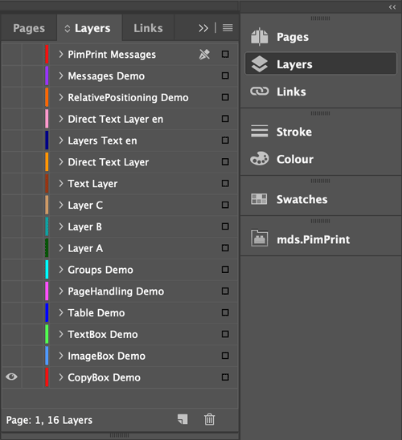

# CommandDemo

Demonstrates each [Rendering Command](../15_Rendering_Commands.md) in a separate publication:

| Publication                                                                                                                                   | Description                                                                                                              |
|-----------------------------------------------------------------------------------------------------------------------------------------------|--------------------------------------------------------------------------------------------------------------------------|
| [CopyBox](https://github.com/mds-agenturgruppe/pimprint-demo-bundle/tree/3.x/src/Project/CommandDemo/CopyBox.php)                          | Copies and resizes elements from template file into generated documents.                                                 |
| [ImageBox](https://github.com/mds-agenturgruppe/pimprint-demo-bundle/tree/3.x/src/Project/CommandDemo/ImageBox.php)                        | Placing of Pimcore Assets.                                                                                               |
| [TextBox](https://github.com/mds-agenturgruppe/pimprint-demo-bundle/tree/3.x/src/Project/CommandDemo/TextBox.php)                          | Placing and styling of text. Includes transforming of HTML to styled InDesign text.                                      |
| [Table](https://github.com/mds-agenturgruppe/pimprint-demo-bundle/tree/3.x/src/Project/CommandDemo/Table.php)                              | Creating of tables programmatically or by parsing HTML. Includes automatic page break feature with SplitTable command.   |
| [Page Handling](https://github.com/mds-agenturgruppe/pimprint-demo-bundle/tree/3.x/src/Project/CommandDemo/PageHandling.php)               | Demonstrates page handling and page layout features using Template command.                                              |
| [Groups](https://github.com/mds-agenturgruppe/pimprint-demo-bundle/tree/3.x/src/Project/CommandDemo/Groups.php)                            | Creation of InDesign element groups and using it for placement and automatic page breaks.                                |
| [Layers](https://github.com/mds-agenturgruppe/pimprint-demo-bundle/tree/3.x/src/Project/CommandDemo/Layers.php)                            | Demonstrates handling of layers.                                                                                         |
| [Localization](https://github.com/mds-agenturgruppe/pimprint-demo-bundle/tree/3.x/src/Project/CommandDemo/Localization.php)                | Demonstrates the localization of page-elements. Localized elements are automatically placed on language-specific layers. |
| [Relative Positioning](https://github.com/mds-agenturgruppe/pimprint-demo-bundle/tree/3.x/src/Project/CommandDemo/RelativePositioning.php) | Position elements relative to each other. This allows the creation of dynamic rule based layouts.                        |
| [Messages](https://github.com/mds-agenturgruppe/pimprint-demo-bundle/tree/3.x/src/Project/CommandDemo/Messages.php)                        | Showing descriptive messages in InDesign plugin.                                                                         |

Every demo publication creates its output into separate layer of the document. This allows to generate all demos into one document and switch the visibility of layers.

