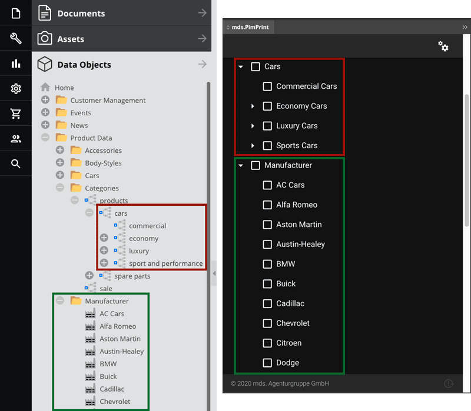
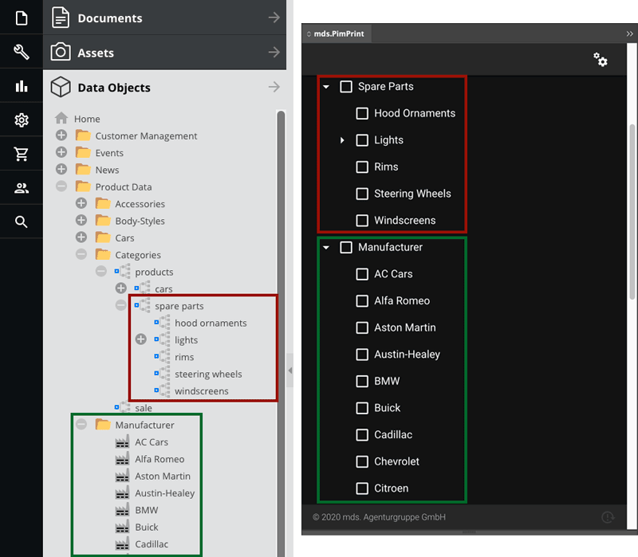
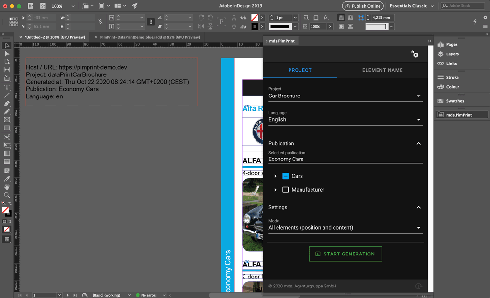
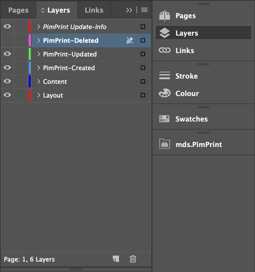
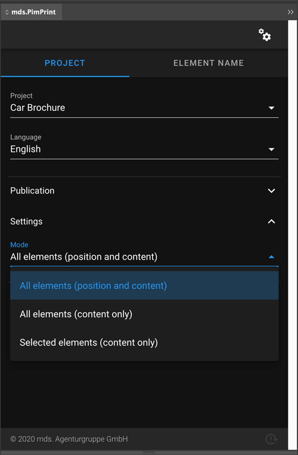
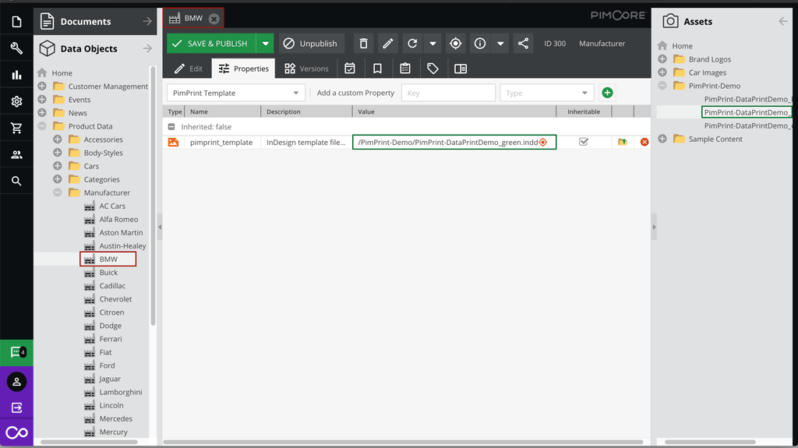

# DataPrint Demos

DataPrint demos are real world example print products generated with content from the Pimcore demo. They show the integration into Pimcore and usage of an arbitrary data model.

* [Project Content](#page_Project_Content)
* [PimPrint Features](#page_PimPrint_Features)

## Project Content

* [Car Brochure / Car List](#page_Car_Brochure_Car_List)
* [AccessoryPart List](#page_AccessoryPart_List)

### Car Brochure / Car List

Car centric print products can be generated for Categories `products/cars` or Manufacturers. The Pimcore DataObject structures are transformed to a publication tree.

### AccessoryPart List

AccessoryPart print products can be generated for Categories `products/spare parts` or Manufacturers. The Pimcore DataObject structures are transformed to a publication tree.

## PimPrint Features

* [Comprehensive Document update](#page_Comprehensive_Document_update)
* [Render Modes](#page_Render_Modes)
* [Changing the Template](#page_Changing_the_Template)

### Comprehensive Document update

After generation process PimPrint creates a textbox on first page outside page margins at top left position on a non printable layer called `PimPrint Update-Info`. This textbox
contains information regarding the generated publication, language, generation timestamp, etc. PimPrint uses this textbox to

PimPrint uses this textbox to identity the publication generated into the document. When a document with this textbox is opened,
or [plugin is reloaded](./01_Overview.md#page_Reload_Plugin), the rendering settings for the current document document is automatically preselected. This allows fast content update
of a previously generated document.

Open your Pimcore Demo backend and edit some data rendered in your document:

- (Un)Publish some cars or car variants
- Edit descriptive texts
- etc.

Go back to InDesign click the _Start Generation_ button.   
This will start a content update of the previous generated document.

After generation is finished the content in the document will be upated with the current data in the Pimcore database. PimPrint uses the InDesign `Articles` panel to display
comprehensive feedback of the update generation process. Click on `Window > Articles` to open the Articles panel.

| Article          | Documentation                                                                                                                                                                                    |
|------------------|--------------------------------------------------------------------------------------------------------------------------------------------------------------------------------------------------|
| PimPrint-Deleted | Elements that has been removed in the update process. In addition to the `Article` a layer with the same name is created and all elements are moved to it. Is set to invisible automatically. |
| PimPrint-Updated | Element content was updated.                                                                                                                                                                     |
| PimPrint-Created | New created elements.                                                                                                                                                                            |

### Render Modes

PimPrint offers different render modes.

| Mode                                          | Documentation                                                                                                                                                                             |
|-----------------------------------------------|-------------------------------------------------------------------------------------------------------------------------------------------------------------------------------------------|
| Generate                                      | Generates or updates elements to position send from server and sets content sent from server.                                                                                             |
| Update                                        | Sets content sent from server in all elements. Leaves element positioning and dimensions untouched. AbstractBox command fits are executed as sent from server..                           |
| Update selected                               | Sets content sent from server into selected elements. Leaves element positioning and dimensions untouched. AbstractBox command fits are executed as sent from server.                     |
| Generate language variants                    | Generates or updates elements for language variants to position from the master-language and sets content sent from server.                                                               |
| Update language variants                      | Sets content sent from server for language variants in all elements. Leaves element positioning and dimensions untouched. AbstractBox command fits are executed as sent from server.      |
| Generate language variants positions          | Updates positions for language variants in all elements to the position from the master-language.                                                                                         |
| Update selected language variants             | Sets content sent from server for language variants in selected elements. Leaves element positioning and dimensions untouched. AbstractBox command fits are executed as sent from server. |
| Generate selected language variants positions | Updates positions for language variants in selected elements to the position from the master-language.                                                                                    |

### Changing the Template

The DataPrint demo projects have a custom example implementation for setting the used InDesign template when generating Category or Manufacturer by assigning a predefined property.

In this example the green demo template is assigned to the Manufacturer BMW. When documents for BMW are generated layout elements will be generated in green.  
As the project implementation with PimPrint is absolutely customizable data model fields or any other logic can be used to determine the used template file.    
