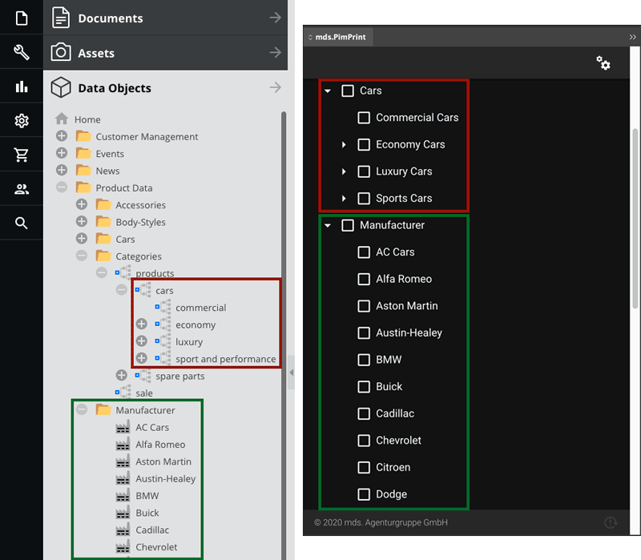
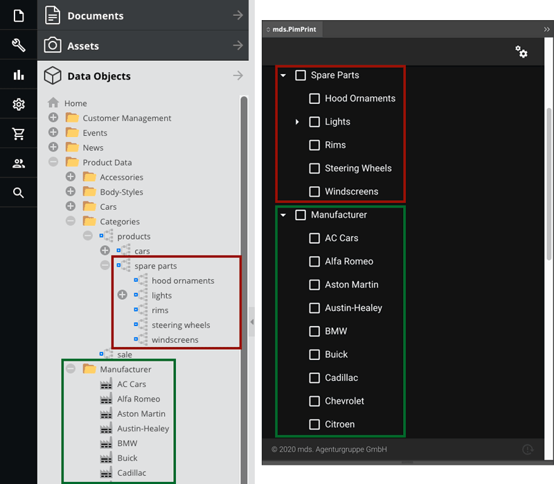
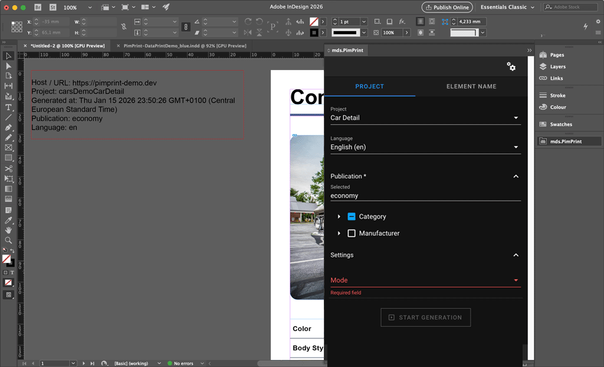
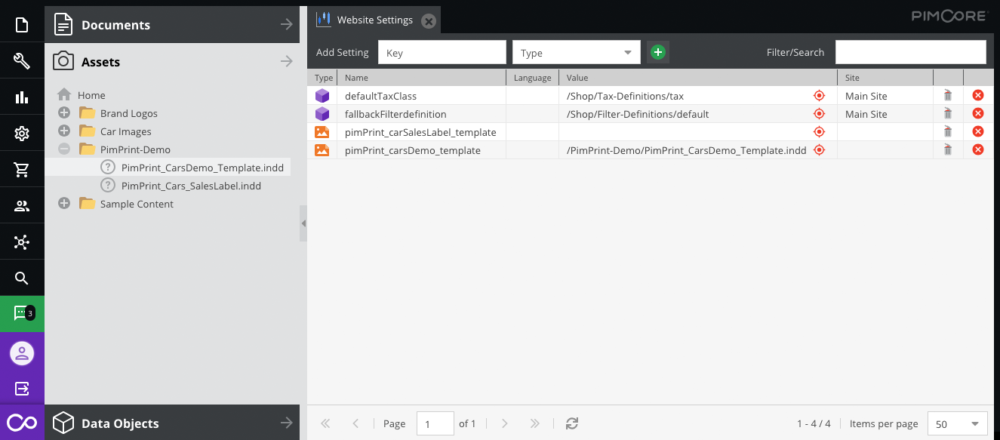
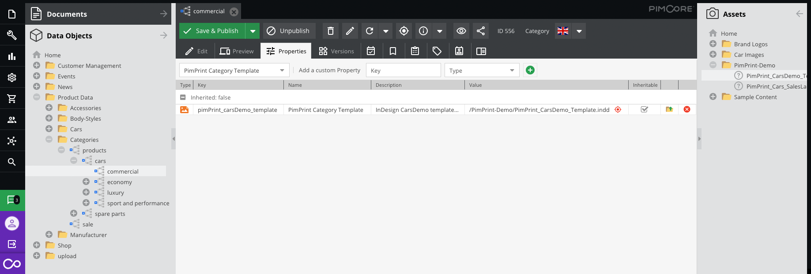
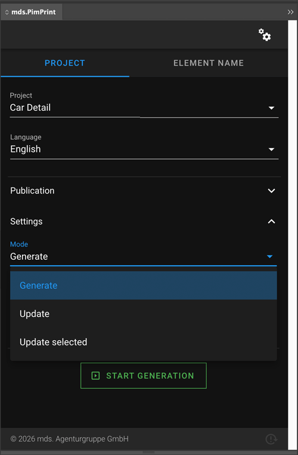

# CarsDemo

CarsDemo a real-world example of print documents generated with content from the Pimcore demo. They show the integration into Pimcore and usage of an arbitrary data model.

* [Overview](#page_Overview)
* [Content Selection](#page_Content_Selection)
* [PimPrint Features](#page_PimPrint_Features)

## Overview

| Project              | Content DataObjects | Content Selection                                               | Chapters | Single- / Facing Pages |
|----------------------|---------------------|-----------------------------------------------------------------|----------|------------------------|
| Car List             | `Car`               | `Categories` from path `products/cars` or `Manufacturer`        | ✅        | Both                   |
| Car Detail           | `Car`               | `Categories` from path `products/cars` or `Manufacturer`        | ✅        | Both                   |
| Car Sales Label      | `Car`               | `Manufacturer` or `Car`                                         | ❌        | Single                 |
| Accessory List       | AccessoryPart       | `Categories` from path `products/spare parts` or `Manufacturer` | ✅        | Both                   |
| Accessory Price List | AccessoryPart       | `Categories` from path `products/spare parts` or `Manufacturer` | ✅        | Both                   |

## Content Selection

* [Car Content](#page_Car_Content)
* [AccessoryPart Content](#page_Accessory_Content)

### Car Content

`Car` DataObject centric print products can be generated for `Categories` DataObjects from path `products/cars` or `Manufacturer` DataObjects. The Pimcore DataObject structures are
transformed
to a publication tree.

### Accessory Content

`AccessoryPart` DataObject centric print products can be generated for `Categories` DataObjects from path `products/spare parts` or `Manufacturer` DataObjects. The Pimcore
DataObject structures are
transformed to a publication tree.

## PimPrint Features

* [Changing the Template](#page_Changing_the_Template)
* [Comprehensive Document update](#page_Comprehensive_Document_update)
* [Render Modes](#page_Render_Modes)

### Comprehensive Document update

After generation process PimPrint creates a textbox on first page outside page margins at top left position on a non-printable layer called `PimPrint Update-Info`. This textbox
contains information regarding the generated publication, language, generation timestamp, etc. PimPrint uses this textbox to

PimPrint uses this textbox to identity the publication and content generated into the document. When a document with this textbox is opened,
or [plugin is reloaded](./01_Overview.md#page_Reload_Plugin), the rendering settings for the current document are automatically preselected. This allows fast content update
of a previously generated document.

To try this out, you need a generated demo document, edit content in the Pimcore admin interface, and generate (update) the already generated document. An example use-case
would be:

- (Un)Publish some cars or car variants
- Edit descriptive texts
- etc.

Go back to InDesign click the _Start Generation_ button.   
This will start a content update of the previously generated document.

After generation is finished, the content in the document will be updated with the current data in the Pimcore database. PimPrint uses the InDesign `Articles` panel to display
comprehensive feedback of the update generation process. Click on `Window > Articles` to open the Articles panel.

| Article            | Documentation                                                                                                                                                                                    |
|--------------------|--------------------------------------------------------------------------------------------------------------------------------------------------------------------------------------------------|
| `PimPrint-Deleted` | Elements that has been removed in the update process. In addition to the `Article` a layer with the same name is created and all elements are moved to it. Is set to invisible automatically. |
| `PimPrint-Updated` | Element content was updated.                                                                                                                                                                     |
| `PimPrint-Created` | New created elements.                                                                                                                                                                            |

### Changing the Template

The InDesign template file used by CarsDemo renderings can be changed in the Pimcore admin interface.

This is an example use-case how the user can change the used template file manually or changing programmatically depending on the selected content. This basic concept can be used
for different szenarios.

#### Website Settings

Global changes to templates via Website Settings:

| Website Setting                   | Documentation                                                       |
|-----------------------------------|---------------------------------------------------------------------|
| `pimPrint_carsDemo_template`      | Changes the template of all renderings except for `Car Sales Label` |
| `pimPrint_carSalesLabel_template` | Changes the template of the `Car Sales Label` rendering             |

#### Predefined Property

As an example of content-dependent template modification, the predefined property `pimPrint_carsDemo_template` "PimPrint Category Template" can be assigned to Category DataObject.
Renderings for this category use the respective template.

> Technical note 
> The InDesign template file can be changed by overwriting the method `getTemplate()`:
`\Mds\PimPrint\DemoBundle\Project\CarsDemo\AbstractCarsDemoProject::getTemplate()`

### Render Modes

PimPrint offers different render modes.

| Mode                                            | Documentation                                                                                                                                                                             |
|-------------------------------------------------|-------------------------------------------------------------------------------------------------------------------------------------------------------------------------------------------|
| `Generate`                                      | Generates or updates elements to position send from server and sets content sent from server.                                                                                             |
| `Update`                                        | Sets content sent from server in all elements. Leaves element positioning and dimensions untouched. AbstractBox command fits are executed as sent from server..                           |
| `Update selected`                               | Sets content sent from server into selected elements. Leaves element positioning and dimensions untouched. AbstractBox command fits are executed as sent from server.                     |
| `Generate language variants`                    | Generates or updates elements for language variants to position from the master-language and sets content sent from server.                                                               |
| `Update language variants`                      | Sets content sent from server for language variants in all elements. Leaves element positioning and dimensions untouched. AbstractBox command fits are executed as sent from server.      |
| `Generate language variants positions`          | Updates positions for language variants in all elements to the position from the master-language.                                                                                         |
| `Update selected language variants`             | Sets content sent from server for language variants in selected elements. Leaves element positioning and dimensions untouched. AbstractBox command fits are executed as sent from server. |
| `Generate selected language variants positions` | Updates positions for language variants in selected elements to the position from the master-language.                                                                                    |

