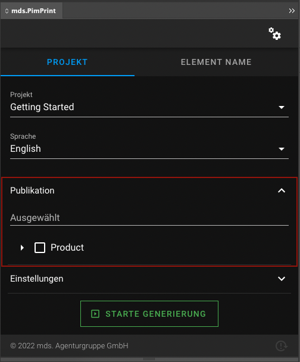
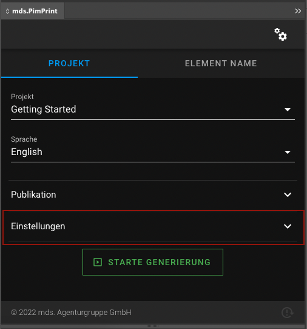
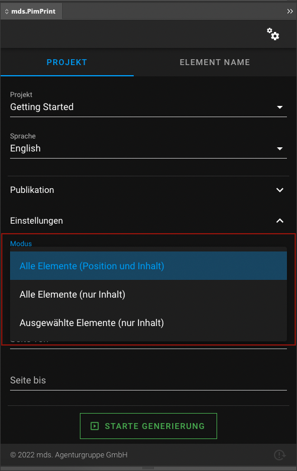
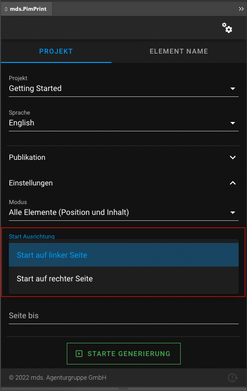

## InDesign plugin factory fields
The PimPrint InDesign plugin has build in fields, called factory fields. Within the project configuration these fields can be customized to match your project needs.

* [Configuration overview](#page_Configuration_overview)
* [Publication field](#page_Publication_field)
* [Update modes field](#page_Update_modes_field)
* [Start alignment field](#page_Start_alignment_field)
* [Page bounds fields](#page_Page_bounds_fields)

### Configuration overview
The configuration of the factory fields is underneath the `plugin_elements` section for each project: 
```yaml
            # Available plugin elements.
            plugin_elements:

                # Show field for update modes.
                update_mode:          true

                # Available update modes for project.
                update_modes:

                    # Defaults:
                    - 501
                    - 502
                    - 512

                # Show field for start left/right page.
                start_alignment:      false

                # Show field for page start/end.
                page_bounds:          false

                # Configuration of default publication select free field.
                publications:

                    # Show publication select tree field.
                    show:                 true

                    # A selection is required or not to start InDesign rendering.
                    required:             true

                    # Optional label for field.
                    label:                null
```
For the complete PimPrint configuration please refer to the [Configuration Reference page](./03_Configuration_Reference.md).

### Publication field
The default so called `Publication` field is the field where the user selects the publication (element) to render in InDesign document.



The behaviour of this field can be configured in the `plugin_elements.publications` section of the config:
```yaml
mds_pim_print_core:
    projects:
        gettingStarted:
            plugin_elements:
                publications:
                    show: true
                    required: false
                    label: 'Custom field label'
```

While rendering the project the selected value from the InDesign Plugin is accessed in your project service with:
```php
$elementId = $this->pluginParameters->get(\Mds\PimPrint\CoreBundle\Service\PluginParameters::PARAM_PUBLICATION);
```

You can disable this field, because you can add [custom form fields](./01_CustomFields/README.md) to the InDesign Plugin to adapt the generation selection process in InDesign to your project needs.

### Setting fields
All other InDesign plugin factory fields are displayed inside the `Settings` pane.



#### Update modes field
The field update mode is a predefined select field which controls the update mode inside InDesign when rendering of a document takes place. The default configuration is suitable for most projects.



The behaviour of this field can be configured in the `plugin_elements` section of the config:
```yaml
mds_pim_print_core:
    projects:
        gettingStarted:
            plugin_elements:
                update_mode: true
                update_modes:
                    - 501
                    - 502
                    - 512
```

As mentioned above the update mode is mainly handled inside the InDesign plugin itself. 

> If you disable the field generation will be done with the default mode: `501`\
> `\Mds\PimPrint\CoreBundle\Service\PluginParameters::UPDATE_ALL_POSITION_CONTENT`

Nevertheless, you can access the selected value in your project service while rendering with:
```php
$updateMode = $this->pluginParameters->get(\Mds\PimPrint\CoreBundle\Service\PluginParameters::PARAM_UPDATE_MODE);
```

#### Start alignment field
The field start alignment is a predefined select field to select if the rendering starts on a left or a right page. In some projects the rendered layout might differ on this page the rendering starts. For these situations the field can be enabled and the selected value can be used while creating the rendering instructions.



The field can be activated in the `plugin_elements` section of the config:
```yaml
mds_pim_print_core:
    projects:
        gettingStarted:
            plugin_elements:
                start_alignment: true
```

While rendering the project the selected value from the InDesign Plugin is accessed in your project service with:
```php
$alignment = $this->pluginParameters->get(\Mds\PimPrint\CoreBundle\Service\PluginParameters::PARAM_START_ALIGNMENT);

$left = \Mds\PimPrint\CoreBundle\Service\PluginParameters::START_ALIGNMENT_LEFT;
$right = \Mds\PimPrint\CoreBundle\Service\PluginParameters::START_ALIGNMENT_RIGHT;
```

#### Page bounds fields
The page bounds field display two input fields for manual input of the starting and ending page number. In some projects this input can be used to dynamically react in the rendering process to this input. PimPrint CoreBundle or InDesign plugin does not use this values by default for anything. The usage must be implemented into your concrete project service.


The field can be activated in the `plugin_elements` section of the config:
```yaml
mds_pim_print_core:
    projects:
        gettingStarted:
            plugin_elements:
                page_bounds: true
```

While rendering the project the entered values from the InDesign Plugin can be accessed in your project service with:
```php
$start = $this->pluginParameters->get(\Mds\PimPrint\CoreBundle\Service\PluginParameters::PARAM_PAGE_START);
$end = $this->pluginParameters->get(\Mds\PimPrint\CoreBundle\Service\PluginParameters::PARAM_PAGE_END);
```
