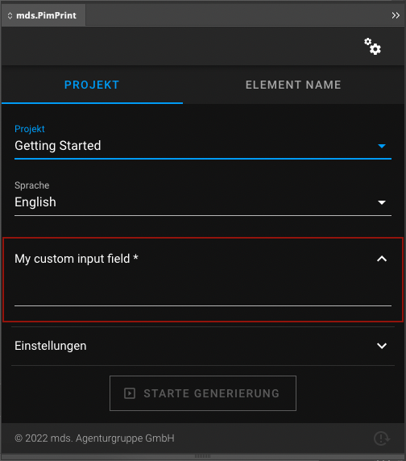

# Input

The most basic custom field is `\Mds\PimPrint\CoreBundle\InDesign\CustomField\Input`. It creates a simple input field for manual user content in the InDesign plugin.

* [Options](#page_options)
* [Usage in PHP API](#page_Usage_in_PHP_API)
* [Display in InDesign](#page_Display_in_InDesign)

## Options

| Option   | Default | Required | Documentation                                                        |
|----------|---------|----------|----------------------------------------------------------------------|
| param    | `null`  | Yes      | Internal identifier of the custom field                              |
| label    |         | No       | Label in InDesign plugin                                             |
| required | `false` | No       | Input is required to start the generation process in InDesign plugin |

> All options are set via setters in the custom field type class.

## Usage in PHP API

You can create your own input field class by extending: \
`\Mds\PimPrint\CoreBundle\InDesign\CustomField\Input`

```php
use Mds\PimPrint\CoreBundle\InDesign\CustomField\Input;

/**
 * Class MyInput
 */
class MyInput extends Input
{
    /**
     * MyInput constructor
     *
     * @throws \Exception
     */
    public function __construct()
    {
        $this->setParam('myInput')
             ->setLabel('My custom input field')
             ->setRequired(true);
    }
}
```

Adding the field to the project service:

```php
<?php
class GettingStarted extends AbstractProject
{
    /**
     * Initializes project specific InDesign plugin form fields
     *
     * @return void
     */
    protected function initCustomFormFields(): void
    {
        $this->addCustomFormField(new MyInput());
    }
}
```

Accessing the input in rendering process:

```php
class GettingStarted extends AbstractProject
{
    /**
     * Generates InDesign Commands to build the selected publication in InDesign.
     *
     * @return void
     */
    public function buildPublication(): void
    {
       $field = new MyInput();
       
       $input = $this->pluginParams->getCustomField($field->getParam());
    }
}
```

## Display in InDesign


