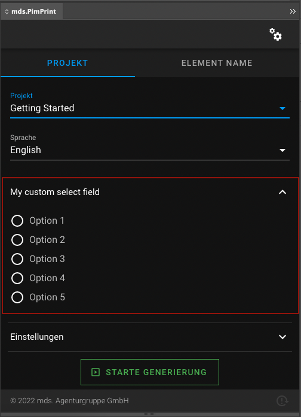
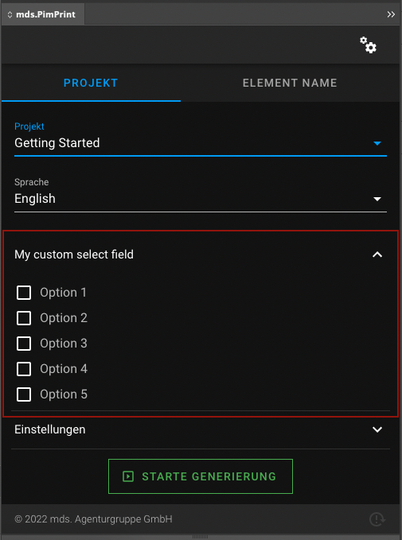
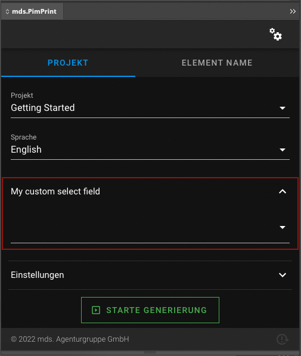
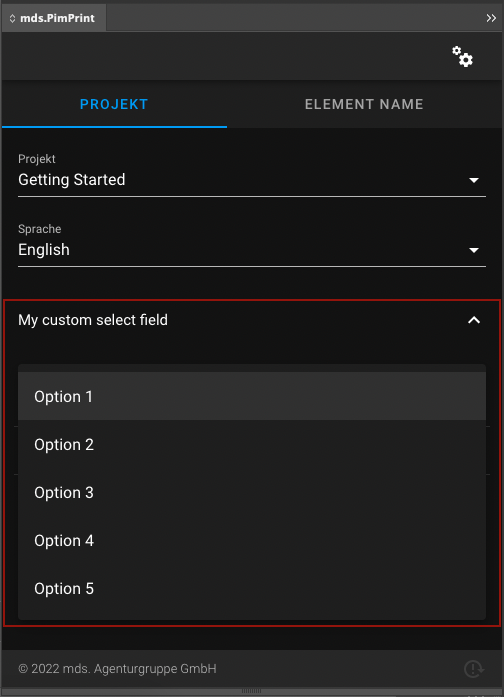
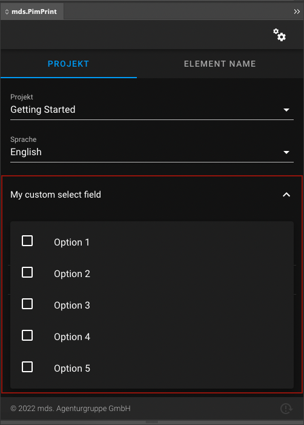

# Select
The custom field `\Mds\PimPrint\CoreBundle\InDesign\CustomField\Select`, creates a selection in the InDesign plugin.

* [Options](#page_options)
* [Usage in PHP API](#page_Usage_in_PHP_API)
* [Display in InDesign](#page_Display_in_InDesign)

## Options
| Option         | Default | Required | Documentation                                                                                                      |
|----------------|---------|----------|--------------------------------------------------------------------------------------------------------------------|
| param          | `null`  | Yes      | Internal identifier of the custom field                                                                            |
| label          |         | No       | Label in InDesign plugin                                                                                           |
| required       | `false` | No       | Input is required to start the generation process in InDesign plugin                                               |
| multiple       | `false` | No       | Multiple `true` or `false` will render a list of Checkboxes or Radios                                              |
| collapseAmount | `5`     | No       | If values count is greater than `collapseAmount`, field will be rendered as a select field. `0` means no collapse. |
| values         | `[]`    | No       | Selectable values                                                                                                  |
> All options are set via setters in the custom field type class.

## Usage in PHP API
You can create your own select field class by extending: \
`\Mds\PimPrint\CoreBundle\InDesign\CustomField\Select`

```php
use Mds\PimPrint\CoreBundle\InDesign\CustomField\Select;

/**
 * Class MySelect
 */
class MySelect extends Select
{
    /**
     * MySelect constructor
     */
    public function __construct()
    {
        $this->setParam('mySelect')
             ->setLabel('My custom select field')
             ->setMultiple(true);

        //In this example values are set upon construct.
        //Values can be set or added by the public setters anywhere in your source.

        //Sets an array of raw values
        $this->setValuesRaw(
            [
                [
                    'value' => 1,
                    'label' => 'Option 1',
                ],
                [
                    'value' => 2,
                    'label' => 'Option 2',
                ],
            ]
        );

        //Adds one value array
        $value = [
            'value' => 3,
            'label' => 'Option 3',
        ];
        $this->addValue($value);

        //Adds values raw programmatically
        $this->addValueRaw(4, 'Option 4');
        $this->addValueRaw(5, 'Option 5');
    }
}
```

Adding the field to the project service:
```php
<?php
class GettingStarted extends AbstractProject
{
    /**
     * Initializes project specific InDesign plugin form fields
     *
     * @return void
     */
    protected function initCustomFormFields(): void
    {
        $this->addCustomFormField(new MySelect());
    }
}
```

Accessing the input in rendering process:
```php
class GettingStarted extends AbstractProject
{
    /**
     * Generates InDesign Commands to build the selected publication in InDesign.
     *
     * @return void
     */
    public function buildPublication(): void
    {
       $field = new MySelect();
       
       $input = $this->pluginParams->getCustomField($field->getParam());
    }
}
```

## Display in InDesign
Single select list: \


Multiple select list: \


Collapsed to select field: \
`

Collapsed single select: \
`

Collapsed multiple select: \
`
