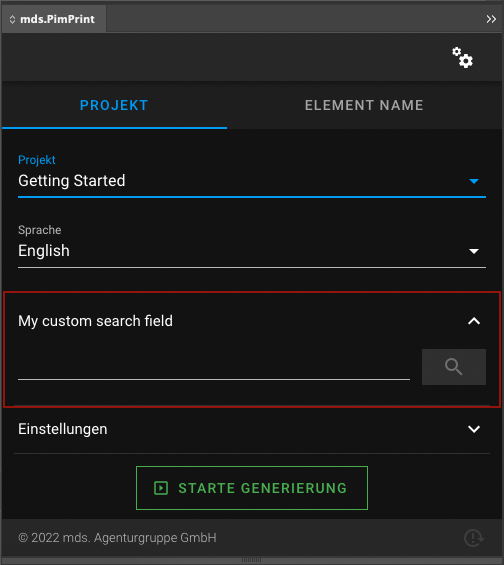
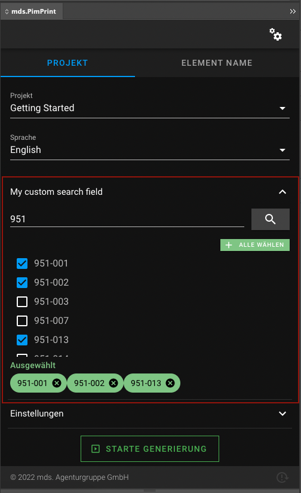

# Search

The custom field `\Mds\PimPrint\CoreBundle\InDesign\CustomField\Search`, creates a input field with a search button. The search is sent to an endpoint to the Pimcore server, where
custom PHP source can create a result list to be selectable in a [select field](./02_CustomField_Select.md) in the InDesign plugin.

* [Options](#page_options)
* [Usage in PHP API](#page_Usage_in_PHP_API)
* [Display in InDesign](#page_Display_in_InDesign)

## Options

| Option         | Default | Required | Documentation                                                                                                   |
|----------------|---------|----------|-----------------------------------------------------------------------------------------------------------------|
| param          | `null`  | Yes      | Internal identifier of the custom field                                                                         |
| label          |         | No       | Label in InDesign plugin                                                                                        |
| required       | `false` | No       | Input is required to start the generation process in InDesign plugin                                            |
| multiple       | `false` | No       | Multiple `true` or `false` will render a list of Checkboxes or Radios                                           |
| collapseAmount | `5`     | No       | If values count is greater than collapseAmount field will be rendered as a select field. `0` means no collapse. |
| autoAdd        | `false` | No       | If `true`, all results will be automatically to the selection list.<br>Only working for multiple `true`         | 
| addAllButton   | `false` | No       | Show add all items button.<br>Only working for multiple `true` and autoAdd `false`                              |
| clearValues    | `false` | No       | If `true` all selected values will be cleared for every new search response.                                    |

> All options are set via setters in the custom field type class.

## Usage in PHP API

The `Search` field must be a concrete implementation of the abstract class: \
`\Mds\PimPrint\CoreBundle\InDesign\CustomField\Search`

The concrete class must implement `\Mds\PimPrint\CoreBundle\InDesign\CustomField\Search::search`. This method executes the search process and returns
a `\Mds\PimPrint\CoreBundle\InDesign\CustomField\Search\Result`.

> You can register your concrete class as a Symfony service too

```php
use Mds\PimPrint\CoreBundle\InDesign\CustomField\Search;
use Mds\PimPrint\CoreBundle\InDesign\CustomField\Search\Result;
use Pimcore\Model\DataObject\Product\Listing;

/**
 * MySearch
 */
class MySearch extends Search
{
    /**
     * ArtikelnummerSearch constructor
     *
     * @throws \Exception
     */
    public function __construct()
    {
        $this->setParam('mySearch')
             ->setLabel('My custom search field')
             ->setAddAllButton(true)
             ->setMultiple()
             ->setNoCollapse();
    }

    /**
     * Creates Search\Result for search $phrase
     *
     * @param string $phrase
     *
     * @return Search\Result
     * @throws \Exception
     */
    public function search(string $phrase): Search\Result
    {
        $result = new Result();

        $phrase = trim($phrase);
        if (empty($phrase)) {
            $result->setSuccess(false)
                   ->addMessage('Please enter a search phrase');

            return $result;
        }

        $listing = new Listing();
        $listing->addConditionParam('code LIKE :code', ['code' => $phrase . '%']);

        foreach ($listing->load() as $product) {
            $result->addResultRaw($product->getId(), $product->getKey());
        }

        if (false === $result->hasResults()) {
            $result->setSuccess(false);
            $result->addMessage('No products found for: ' . $phrase);
        }

        return $result;
    }
}
```

For implementation details see [custom field search endpoint page](../../25_Development/13_CustomField_Search_Endpoint.md).

Adding the field to the project service:

```php
<?php
class GettingStarted extends AbstractProject
{
    /**
     * Initializes project specific InDesign plugin form fields
     *
     * @return void
     */
    protected function initCustomFormFields(): void
    {
        $field = $this->getSearchFieldService();
        
        $this->addCustomFormField($field);
    }
}
```

Accessing the input in rendering process:

```php
class GettingStarted extends AbstractProject
{
    /**
     * Generates InDesign Commands to build the selected publication in InDesign.
     *
     * @return void
     */
    public function buildPublication(): void
    {
       $field = $this->getSearchFieldService()
       
       $input = $this->pluginParams->getCustomField($field->getParam());
    }
}
```

## Display in InDesign

Empty search field: \


Search result list in multiple mode with selected elements:

