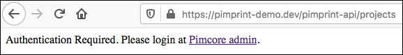

# Developing with PimPrint
This chapter gives a quick introduction to implement InDesign document generation with PimPrint:
* [Start developing](#page_Start_developing)
* [REST API](#page_REST_API)
    * [Projects Endpoint](./10_Projects_Endpoint.md)
    * [Project Endpoint](./11_Project_Endpoint.md)
    * [Execute Endpoint](./12_Execute_Endpoint.md)
* [Debugging](#page_Debugging)
* [PimPrint with HTTP Proxy](#page_PimPrint_with_HTTP_Proxy)
 
## Start developing
To start developing with PimPrint good entry points are the fully documented example projects provided with the [PimPrint-Demo](../05_PimPrint-Demo/README.md).
Start with the [demo rendering Services](https://github.com/mds-agenturgruppe/pimprint-demo-bundle/tree/master/src/Service) and perhaps [step through them with a debugger](#page_Debugging).  

For a full documented demo of all [Rendering Commands](../15_Rendering_Commands.md) refer to the [Command demos classes](https://github.com/mds-agenturgruppe/pimprint-demo-bundle/tree/master/src/Project/CommandDemo) also included in [PimPrint-Demo](../05_PimPrint-Demo/README.md).

## REST API
PimPrint InDesign plugin communicates with the server over a REST API.

All endpoints are implemented in `\Mds\PimPrint\CoreBundle\Controller\InDesignController` which exposes this three endpoint routes.
```
mds_pimprint_core_indesign_projects 		/pimprint-api/projects
mds_pimprint_core_indesign_project     		/pimprint-api/project/{identifier}
mds_pimprint_core_indesign_executeproject 	/pimprint-api/project/{identifier}/run
```
* [Projects Endpoint](./10_Projects_Endpoint.md)
* [Project Endpoint](./11_Project_Endpoint.md)
* [Execute Endpoint](./12_Execute_Endpoint.md)
  
As PimPrint uses Pimcore User logins for securing access and uses the Pimcore Users and Roles for data access permissions an active Pimcore backend login session is required when accessing the REST API. Therefore, you have to authenticate with the Pimcore backend first when accessing the REST API with a browser.



## Debugging
To debug, and step analyse the demos and your own projects, you could set your Xdebug extension to autostart on every request by editing your php.ini enabling direct debugging from InDesign.

 ```ini
xdebug.remote_autostart=1
```
 
The more convenience way is to access the REST API endpoints directly in a browser and [start the debugging session](https://www.jetbrains.com/help/phpstorm/browser-debugging-extensions.html). Note that an active Pimcore backend login session is required as noted above.
  
## PimPrint with HTTP Proxy
By default, PimPrint downloads template and asset files directly from the Pimcore server over HTTP(S) and builds the protocol, hostname and port automatically. In some circumstances this can fail when Pimcore is running behind a HTTP Proxy and leads to download errors like:
> AssetDownloader Template Error:   
>  connect ETIMEDOUT 127.0.0.1:8017   
>  http ://pimprint-demo.dev:8017/.../PimPrint-DataPrintDemo_blue.indd

For such environments `mds_pimprint_core_bundle` [configuration node](../10_Rendering_Projects/00_Configuration_Reference.md) has the `host` element to configure the used protocol, hostname and port. Add the configuration matching your infrastructure:
```yaml
mds_pim_print_core:
    host:
      #hostname: ''
      protocol: 'https'
      port: ''
```
This configuration leads to download urls like for the error shown above: 
```
https://pimprint-demo.dev/.../PimPrint-DataPrintDemo_blue
```
